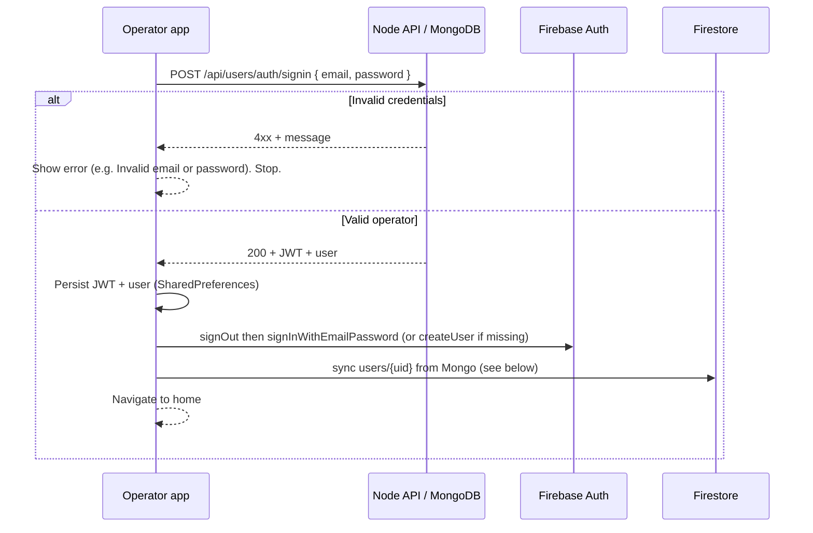

# Operator login flow — MongoDB primary, Firebase secondary

This document describes the **intended behavior** and how the **PasaHero operator** Flutter app implements it.

## Roles of each system

| System | Role |
|--------|------|
| **MongoDB** (via Node API on Vercel) | **Source of truth for authentication.** Email/password are checked here. Successful sign-in returns a **JWT** and the **user** document (including `_id`, `email`, `role` / `roleid`). |
| **Firebase Auth** | **Secondary session** for Firestore rules (`request.auth != null`). Uses **Email/Password** with the **same** email and password Mongo accepted: `signInWithEmailAndPassword`, or **`createUserWithEmailAndPassword`** if no Firebase user exists yet (shadow account). **Anonymous sign-in is not used.** |
| **Firestore** | **Secondary store** for real-time features (e.g. `users/{uid}`, `operator_locations`, `driver_status`). One profile document per Firebase Auth `uid`, with **`mongo_user_id`** and **`email`** linking back to Mongo. |

## High-level flow

## Step-by-step logic

### 1. Validate credentials (Mongo only)

- Call **`POST {BACKEND_URL}/api/users/auth/signin`** with `email` and `password`.
- If the server responds with failure (wrong password, email not found, etc.):
  - Show a clear error such as **“Invalid email or password”** (or the server message).
  - **Do not** write to Firestore for this attempt.
- If the server succeeds:
  - Confirm the user is an **operator** (`role` / `roleid` in the payload).
  - Require a **JWT** in the response; otherwise treat as failure.

### 2. Persist Mongo session (client)

- Store **JWT** and **user map** locally (`OperatorSessionService`) for session restore and optional future API calls (`Authorization: Bearer <jwt>`).

### 3. Firebase Auth (secondary — Email/Password only)

- **Sign out** any previous Firebase user.
- **`signInWithEmailAndPassword`** using the same email variant that succeeded against Mongo and the same password.
- If sign-in fails with **`user-not-found`**, **`invalid-credential`**, or **`wrong-password`**, call **`createUserWithEmailAndPassword`** (Firebase often uses `invalid-credential` when **no** Auth user exists yet, not only for wrong passwords). If create returns **`email-already-in-use`**, then a Firebase user already exists and the password truly conflicts — show a clear admin-reset message instead of blaming “wrong Firebase password” when no user was visible.
- **Requirement:** **Email/Password** must be **enabled** in Firebase Console (Authentication → Sign-in method → Email/Password). No Anonymous provider is required.

### 4. Firestore sync (secondary — no duplicate profile)

Path: **`users/{firebaseAuthUid}`** (email/password auth `uid`).

After Mongo success, the app loads the existing doc (if any):

| Firestore state | Action |
|-----------------|--------|
| **No document** | **Create** the profile: `email`, `mongo_user_id`, `role`, `roleid`, names, optional `routeCode` / `route_code`, `createdAt`, `last_mongo_login_sync_at`. |
| **Document exists** and `mongo_user_id` **and** `email` (normalized) **already match** the current Mongo user | **Do not** rewrite the full profile. Only merge **`updatedAt`** and **`last_mongo_login_sync_at`** (fast path). |
| **Document exists** but link differs | **Merge** full fields with `SetOptions(merge: true)`. |

### 5. Cold start / resume

- **Splash:** If a **valid JWT** exists and Firebase already has a **non-anonymous** signed-in user, merge Firestore and go home.
- If JWT exists but **no** Firebase user (e.g. new device), navigate to **login** so the operator can enter the password again (Mongo + Firebase steps repeat quickly).
- **Sign out:** Clear JWT prefs and Firebase Auth sign-out.

## Operator expectations

- **Fast path:** Mongo failure → immediate error.
- **Success path:** One API round-trip, then Firebase email/password (sign-in or one-time create), then Firestore sync.
- **Terminal-admin accounts** live in Mongo first; Firebase may auto-create a matching Auth user on first successful login.
- **In-app self-registration is disabled**; operators are created in the admin system (Mongo) only.

## Related code

- `lib/features/auth/login/login_form.dart` — `_login()`, `_establishFirebaseAuthForFirestore()`.
- `lib/core/services/operator_session_service.dart` — JWT persistence + Firestore sync idempotency.
- `lib/splashscreen/splashscreen.dart` — session restore.
- `lib/core/config/api_config.dart` — `BACKEND_URL` (default Vercel).
